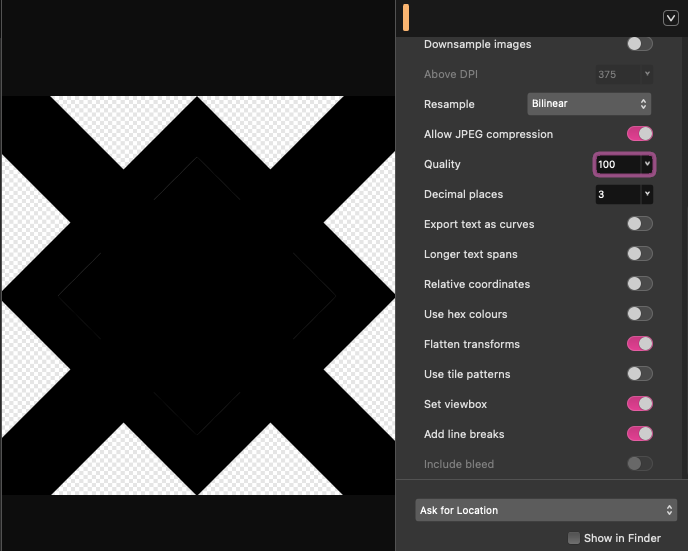
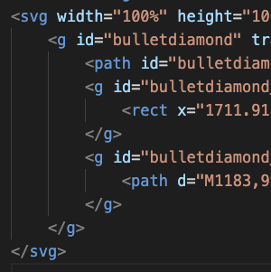
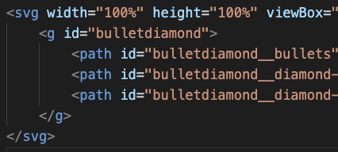

# Roster Card
Live link: [midnattlantern.github.io/roster-card](https://midnattlantern.github.io/roster-card/)

## About Roster Card
Roster card is an experimentation and R&D lineaging from [MultiCo Roster](https://midnattlantern.github.io/multico-roster/), to discover new creative ways to express and present artistic elements for MultiCo Roster through mutable vector graphics. This experimentation serves to support my personal ambition to design engaging user interactions and convince visitors/users through instinct. It's also part of vocational training in graphical design.

My history with graphical design range all the way back to 2017 (2015 with raster art), trained through junior high and self taught curiosity. Up until this project, my vector skills didn't stretch beyond Adobe Illustrator/ Affinity, and static SVG inline or img url import, as well as basic fill manipulation in css. This project dig deeper down the low-end source code of an SVG file, from editing id's and classes, to change the text content of a <text> element in JavaScript.

Nicolette is the original character featured on this project. Written and designed by my friend, and reimagined and illustrated by me.

## Features
- Click the hero banner, a neon text with Nicolette's name will slide in.
- Click the hero banner again, the neon text will shift in appearance from just outline to fill.
- Click either splash hero button, the neon text will appear if it hasn't already showed up.
- Scroll while hovering the hero banner, the neon text will slide away.

## Raster asset(s)
The featured images are a set of drawings pulled from [MultiCo Roster](https://midnattlantern.github.io/multico-roster/). It's been compressed from its lossless PNG-format to a resource friendly webp-format through Affinity. These are the hero images, so they are the main attraction of this project. Because these assets feature transparent pixels, I can test making a backdrop shadow that isn't a square. The width and height of the source material vary in width, height and aspect ratio, which is a problem for a layout design that demand a fixed rule, this can be solved using Affinity's document setup tool and set the width/ height from there.

The grid image is a screenshot of Blender's editor view, an appropriate background for a R&D project experimenting on graphical technicality.

## Vector asset(s)


## AI disclosure
[no-ai-icon.com](https://no-ai-icon.com/)

I remain committed to distancing myself from AI and LLMs by minimizing my use of them. Claude have been involved strictly for looking up technical information, such as TypeScript flags or syntax, Vite documentation, or oddly specific SVG gotchas, alongside traditional reading in forums such as Reddit or Stack Overflow. However, no code, nor any vector and raster assets were AI generated.

Generating a raster image through AI was part of the vocational training programme. This project dodged that task by raising ethical concerns (carbon emissions, uncompensated artist theft, etc.) with the teacher. This is not an outright rejection of generative AI and its inevitable use in professional life, but an act to reduce its use whenever possible, reserving generative AI until it's absolutely necessary while encouraging more ethical methods of creation.

In a theoretical scenario where I would resort to [OpenArt.ai](https://openart.ai/suite/create-image/byte-plus-seedream-4-5), I'd upload [this image](https://se.pinterest.com/pin/415738609356010366/) as reference, and give it the prompt _"Video game splash art, fusing western and east Asian 'anime', floral black pattern on the trenchcoat, add silver plates on the shoulders. Wind flowing toward the figure. Remove the hat, give the figure shoulder-long straight silver hair following the wind. Replace the cane with a naginata with Victorian characteristics, as tall as the figure, the blade pointing to the sky."_ From what I've heard, the more specific the prompt, the better the results, but the outcome could still go either way.

## Other notes
To access the code of an SVG file in VS code, right click the file in the explorer, select "Open With...", then select "Text Editor".

When using the SVG import as an image source, you're stuck with a static asset that cannot be mutated. Inline enable full customization and access to the path's id's. However, that would make your HTML or JavaScript messy and WET. To get the best of both worlds, Vite can import the SVG as a string, by adding `?raw` at the end of an SVG import. Make an SVG vessel (container) and fill that vessel with the SVG string import. [vite.dev/guide/assets](https://vite.dev/guide/assets)
``` JavaScript
// JavaScript
import mySVG from './assets/mySVG.svg?raw';

const mySVGVessel = document.createElement("div");
mySVGVessel.innerHTML = mySVG;
```

Exported SVG files, (As far as I'm aware) will have a default value of width and height of 100%. This means the SVG will be as large or small as its parent/ container.
``` JavaScript
// JavaScript
mySVGVessel.classList.add("my-svg-vessel");
```
``` css
/* css */
.my-svg-vessel {
    width: 100px; /* 10px or 10000px, the SVG will scale */
}
```

## Deployment
Roster card is hosted on Github pages. Deployment is done through the gh-pages node package. Whenever the project is ready for publicity, make sure your console is on the same directory as package.json (check with the `ls` command), then run the following command in the terminal:
``` zsh
npm run deploy
```

## Valuable lessions & what I leaned
### Export & path compression
When exporting a vector asset in Affinity, most shapes may be intended to be exported as general `<path>` elements, however, if they resemble shapes such as rectangle or circle, even after converting to curves in Affinity, the metadata may turn them into specific shapes grouped in a `<g>` tag with matrix transformations and lots of metadata, making the SVG hard to maintain and messy in the code editor. This is great for optimization, as for instance a rectangle with transformation metadata, may take less space than a general path element. However, if you intend to dive into the metadata, path may be prefferable. To address this, you need to check the "Flatten transforms" checkbox in the export view.

"Flatten transforms" is checked:


SVG meta data is messy and hard to read unless you intentionally need the groups and shape specific elements:


SVG meta data is clean and easily maintainable, preferable if you only need general path elements:


### Exported with Paddings due to stroke's caps
The vector assets of this project use more shapes and less strokes than initially intended. Strokes can bring unintended and invisible issues, such as featuring a stroke from edge to edge, after export, Affinity may create some padding to accommodate for the cap of a stroke. This may cause layout issues, even if you set the cap to "butt cap". Expanding a stroke, turning it into a shape here can solve it.

### Unsolved - GSAP and clipping paths
In attempt to learn transitional animation by transforming the position directly from an SVG file using JavaScript (GSAP), some vector elements are nested in a `<clipPath>` 'container', and its shape overlapping the clipPath:s size. The idea is to target the shape inside `<clipPath>` with its id, then apple a gsap animation. Being new to this front of development, I am unsure how to compare this method to using HTML and CSS, or how HTML and XML may behave differently regarding this, or even what method is optimal, encouraged and discouraged. I had a pain-point encounter while doing the horizontal infinite scroll of the slanted lines for the hero-index display; first of all, GSAP couldn't seem to control how far I wanted to apply the x-transformation, whether giving a positive or negative integer, even 0, didn't make a difference. Neither px units in quotations. Currently, it's just an empty string, which seem to be enough to make it move at all. The next pain point were my limitated option to the clip-paht's witdh. For reasons I couldn't figure out, I am limited to a oddly specific width, I had to accept a max-witdh or make it smaller, leaving it wider would give me a gap after the GSAP animation finished. Making the overlapping shape wider in Affinity didn't seem to do any difference whatsoever, it only made GSAP scroll faster as there were more content to scroll through. I am content with the final result, but if I had more technical knowledge during the making of this, the horizontal scroll animation would be wider.

## Acknowledgements
https://www.fontspace.com/martin-gaming-font-f162455
https://no-ai-icon.com/